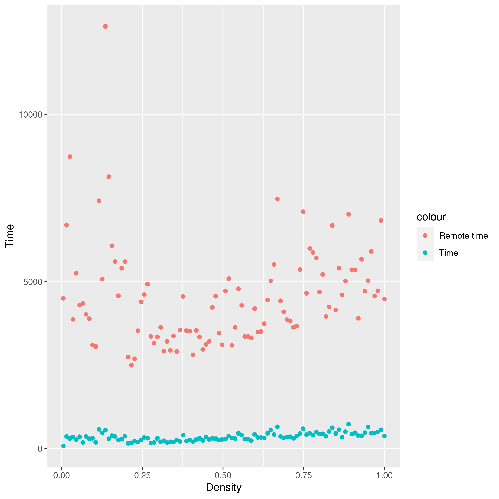

# Task 1 - Java RMI

There will be many mentions of files that no longer exist, they will be stored in git repositories history

## Local measurement

[Snapshot of the files here](https://github.com/jiriklepl/NSWI080/commit/b87eaad090a835128384178c0d0ef799248605f1)

### Implementation

- the `Main` implementation was modified to receive the number of vertices and edges as optional arguments for easier measurements

### Measurement

- 100 files `local_measurement_*` were generated by the `local_measurement` bash function in `scripts.sh` (all of them were measured on 1000 vertices)
- then the R script `local_measurements.R` generated the two `local_measurements\d.png` files containing the results for the this step of the assignment

TODO: comment the plots

## Remote Searcher

[Snapshot of the files here](https://github.com/jiriklepl/NSWI080/commit/819bcb62ee3ef36bcc231beb10f8cb37fee62ba0)

### Implementation

- all files were modified as implied by the assignment
  - in the output of `searcherBenchmark`, there are two more columns showing the times for remote searcher
    - the remote tests are done right after their respective local tests
    - the benchmarking function checks validity of the remote distance results
  - the server implementation was based on the `ExampleServer` implementation
- `Node` extends `Serializable` so it gets serialized and sent over the network at once
  - this is quite efficient and each node is sent only once (the serializer understands references)
  - this solution adds a lot of latency towards the first request and a lot of memory overhead
- there is a new class `ServerCommon` which stores data which are shared between the client and the server (e.g the server's name)
- sharing the same simple `SearcherImpl` didn't really work (the instance, which extends `UnicastRemoteObject`, is owned by another thread and survives the Main thread)
  - `SearcherImpl` was reverted to the original state
  - there is a separate `RemoteSearcherImpl` which wraps a `SearcherImpl`, still implementing `Searcher`, instance and extends `UnicastRemoteObject`

### Measurements

- 100 files `remote_searcher_*` were generated by the `remote_searcher` bash function in `scripts.sh` (all of them were measured on 200 vertices, this is due to added overhead)
- then the R script `remote_searcher.R` generated the three `remote_searcher*.png` files containing the results for the this step of the assignment

#### **Dependence of time on density**

We can clearly see the overhead of a remote call with serialization, it averages around multiple thousands of nanoseconds. The plots do not show this, but the first request in every set of measurements is accompanied by sending a serialized graph component (there may be more such subsets in each set) which is associated with an overhead higher by multiple orders of magnitude. The subsequent calls where both nodes are in already received components are much faster.

The shape is very distorted by serialization and it doesn't resemble the original plot at [Local measurement](#Local-measurement).

#### **Dependence of time on distance**

These two plots only further confirm there is a lot of overhead associated with the remote calls with serialization.

## Remote Nodes

[Snapshot of the files here](https://github.com/jiriklepl/NSWI080/commit/b20238a64e9f0b7f1887b9d92c8c9fc2b9f0ad04)

### Implementation

- the files were modified according to the assignment
  - there is `NodeImpl` for local nodes and `RemoteNodeImpl` for remote nodes and their respective factories
  - the methods in `SearcherClient` were reworked to facilitate further implementations
    - `createNodes` takes a `NodeFactory` and returns a graph
    - `connectAllNodes` takes the graph as a parameter
    - `connectSomeNodes` takes an array of graphs as a parameter and connects all graphs similarly
    - `searchBenchmark` takes the graph and the searcher as parameters and then it either takes a number of tests to be performed or a list of indices of nodes it will perform the algorithms on; then the method returns the list of indices the test used (in both cases)
      - these changes allow as to perform the same tests on multiple searchers and graphs
  - the `SearcherCommon` class proved useful as sharing a name of a new class added to `RMI` can be done by adding a new static final field
- old measurements were removed and the `scripts.sh` file was moved to the root folder

### Measurement

- 100 files `remote_nodes_*` were generated by the `remote_nodes` bash function in `scripts.sh` (all of them were measured on 200 vertices)
- then the R script `remote_nodes.R` generated the two `remote_nodes*.png` files containing the results for the this step of the assignment

#### **Dependence of time on density**

This graph shows this solution is unsurprisingly even slower than the previous one as there is a continuous stream of `Node`s from the client to the server (overhead of accessing them via function calls).

We can see the plot for "Remote time" copies the shape of the very first plot at [Local measurement](#Local-measurement) which is due to the implementation sending Nodes as they are requested.

#### **Dependence of time on distance**

This graph, once again, resembles the original graph at [Local measurement](#Local-measurement), but its values further confirm the overhead of remote calls.

## Remote Nodes and Searcher

[Snapshot of the files here](https://github.com/jiriklepl/NSWI080/commit/a02ac66d67f29971c158c2a6bab8ea2c9adf4d15)

### Implementation

- the client was modified according to the assignment

### Measurement

- 100 files `remote_nodes_and_searcher_*` were generated by the `remote_nodes_and_searcher` bash function in `scripts.sh` (all of them were measured on 200 vertices)
- then the R script `remote_nodes_and_searcher.R` generated the two `remote_nodes_and_searcher*.png` files containing the results for the this step of the assignment

#### **Dependence of time on density**

This graph suggests there is a slight improvement in time compared to the previous solution, but the improvement isn't very noticeable. This suggests that there is still very similar communication between the client and the server.

#### **Dependence of time on distance**

This graph further confirms that the performance of this and the previous solutions are almost the same.

## Impact of the Network

[Snapshot of the files here](https://github.com/jiriklepl/NSWI080/commit/6b5cda323a75e527d421058a6a0cd3c1aa0c0faf)

### Implementation

- the client was modified by adding one more call to the `searcherBenchmark` method as assigned
- the `SearcherCommon` class proved itself useful once again as only two modifications to this very file were required to make the application run correctly

### Measurement

- 10 files `impact_of_the_network_*` were generated by the `impact_of_the_network` bash function in `scripts.sh` (all of them were measured on 20 vertices)
- then the R script `impact_of_the_network.R` generated the two `impact_of_the_network*.png` files containing the results for the this step of the assignment

#### **Dependence of time on density**

This graph shows that the worst solution for the problem is using the nodes remotely on the client.

#### **Dependence of time on distance**

This graph shows the same things as the previous one.

## Passing by Value vs. Passing by Reference

### Implementation

- The client was modified to run only two benchmarks: *remote nodes* and *remote searcher*
- other than that no files had to be modified

### Tuning

Tuning was done only on the graph with 100 vertices and 200 edges as the times for measurement are astronomical in this solution. But with a little experimentation the optimal tuning seems heavily dependent on the size and density of the graph, but with only a little speedup.

The final choice for the parameter to the transitive algorithm was 5.

### Measurement

- 1 file `value_vs_reference*` was generated by the `value_vs_reference` bash function in `scripts.sh` (all of them were measured on 20 vertices)
- then the R script `value_vs_reference2.R` generated the`impact_of_the_network2.png` file containing the results for this step of the assignment

This graph shows the two algorithms give fairly similar results in both the variations of the setup (remote searcher / remote nodes) with only two outlying values that seem to be due to network instability.
