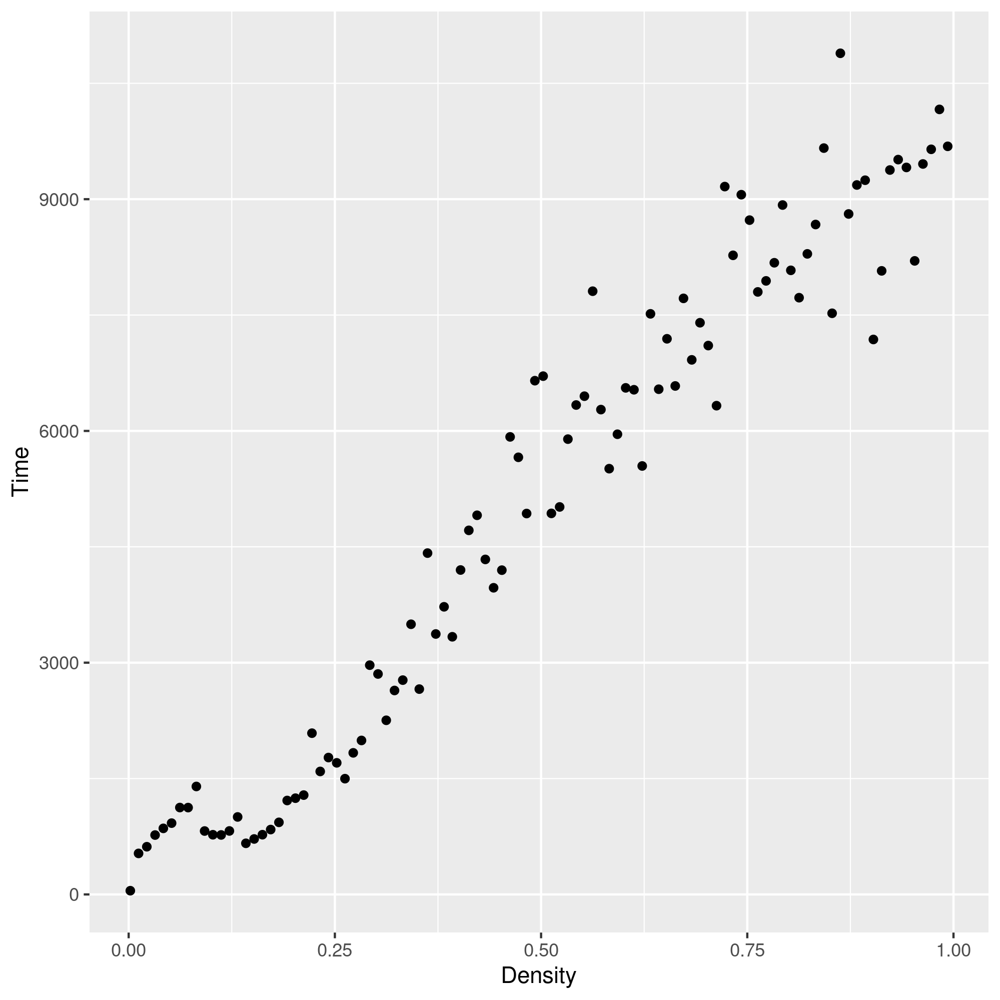

# Task 1 - Java RMI

There will be many mentions of files that no longer exist, they will be stored in git repositories history

## Local measurement

- the `Main` implementation was modified to receive the number of vertices and edges as optional arguments for easier measurements

- 100 files `local_measurement_*` were generated by the `local_measurement` bash function in `scripts.sh`
- then the R script `local_measurements.R` generated the two `local_measurements\d.png` files containing the results for the first step of the assignment

TODO: comment the plots

## Remote Searcher

### Implementation

- all files were modified as implied by the assignment
  - in the output of `searcherBenchmark`, there are two more columns showing the times for remote searcher
    - the remote tests are done right after their respective local tests
    - the benchmarking function checks validity of the remote distance results
  - the server implementation was based on the `ExampleServer` implementation
- `Node` extends `Serializable` so it gets serialized and sent over the network at once
  - this is quite efficient and each node is sent only once (the serializer understands references)
  - this solution adds a lot of latency towards the first request and a lot of memory overhead
- there is a new class `ServerCommon` which stores data which are shared between the client and the server (e.g the server's name)
- sharing the same simple `SearcherImpl` didn't really work (the instance, which extends `UnicastRemoteObject`, is owned by another thread and survives the Main thread)
  - `SearcherImpl` was reverted to the original state
  - there is a separate `RemoteSearcherImpl` which wraps a `SearcherImpl`, still implementing `Searcher`, instance and extends `UnicastRemoteObject`

### Measurements

- 100 files `remote_searcher_*` were generated by the `remote_searcher` bash function in `scripts.sh`
- then the R script `remote_searcher.R` generated the three `remote_searcher*.png` files containing the results for the first step of the assignment

#### **Dependence of time on density**

We can clearly see the overhead of a remote call, it averages around multiple thousands of nanoseconds. The plots do not show this, but the first request in every set of measurements is accompanied by sending a serialized graph component (there may be more such subsets in each set) which is associated with an overhead higher by multiple orders of magnitude. The subsequent calls where both nodes are in already received components are much faster.

#### **Dependence of time on distance**

These two plots only further confirm there is a lot of overhead associated with the remote calls.